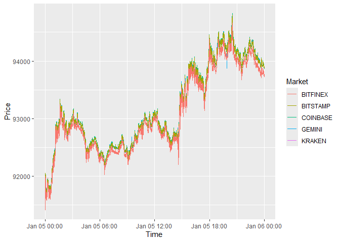

<!-- README.md is generated from README.Rmd. Please edit that file -->

# pricediscovery: Price discovery analysis under “one-security-many-markets” setting

<!-- badges: start -->

<!-- badges: end -->

The `pricediscovery` pacakge is used to conduct price discovery analysis
according to the Hasbrouck (1995)’s “one-security-many-markets” setting.
Current version can calculate Gonzalo and Granger (1995)’s component
shares (CSs), Hasbrouck (1995)’s information shares (ISs), and Putniņš
(2013)’s information leadership shares.

This package tries to implement such an empirical setting in an easy
way. I would particularly focus on a case where the number of markets N
\> 2 as prior implementation is restrictive to bi-variable setting.

This package also helps to resample the price series. Raw financial data
might be in tick level, or the data frequency between markets is not the
same. Hence, a resampling is needed when conducting price discovery
analysis.

## Background

Financial price discovery characterizes how information is incorporated
into the fundamental values and many studies have suggested this process
across multiple venues. The price discovery happens when the same
security is traded among different venues, such as E-mini S&P 500
futures and SPY, the ETF. Knowing which market is informative to price
formation process is important for market participants, especially for
regulators, to understand the dynamics of market microstructure. This is
also helpful for intraday arbitragers to understand better for lead-lag
relationship.

## Methodology

For full methodological details, see the package vignette:

``` r
vignette("methodology", package = "pricediscovery")
```

## Installation

You can install the development version of pricediscovery like so:

``` r
#install.packages("devtools")
devtools::install_github("richie-ma/pricediscovery")
library(pricediscovery)
```

## Example

I use a sample dataset for BTC-USD trade prices from five major
cryptocurrecny exchanges: Kraken, Gemini, Coinbase, Bitstamp, and
Bitfinex on January 5, 2026.

### Data resampling

Let’s resample every market data to 1-second frequency and then merge
all together.

``` r

### using the test datasets
library(ggplot2)
library(pricediscovery)
#> Registered S3 method overwritten by 'quantmod':
#>   method            from
#>   as.zoo.data.frame zoo
kraken <- readRDS(testthat::test_path("btcusd_kraken.rds"))[, .(time, kraken=price)]
gemini <- readRDS(testthat::test_path("btcusd_gemini.rds"))[, .(time, gemini=price)]
coinbase <- readRDS(testthat::test_path("btcusd_coinbase.rds"))[, .(time, coinbase=price)]
bitstamp <- readRDS(testthat::test_path("btcusd_bitstamp.rds"))[, .(time, bitstamp=price)]
bitfinex <- readRDS(testthat::test_path("btcusd_bitfinex.rds"))[, .(time, bitfinex=price)]

mkt_data <- list(kraken = resample(kraken, 'time', 'secs', 1, "00:00:00", "23:59:59"), 
                 gemini = resample(gemini, 'time', 'secs', 1, "00:00:00", "23:59:59"), 
                 coinbase = resample(coinbase, 'time', 'secs', 1, "00:00:00", "23:59:59"), 
                 bitstamp = resample(bitstamp, 'time', 'secs', 1, "00:00:00", "23:59:59"), 
                 bitfinex = resample(bitfinex, 'time', 'secs', 1, "00:00:00", "23:59:59"))

mkt_data_1s <- Reduce(
  function(x, y) merge(x, y, by = "DT"),
  mkt_data
)

mkt_data_1s
#> Key: <DT>
#>                         DT  KRAKEN   GEMINI COINBASE BITSTAMP BITFINEX
#>                     <POSc>   <num>    <num>    <num>    <num>    <num>
#>     1: 2026-01-05 00:00:00 91507.0 91493.73 91489.03    91498    91463
#>     2: 2026-01-05 00:00:01 91507.0 91493.73 91488.63    91498    91463
#>     3: 2026-01-05 00:00:02 91507.0 91493.73 91489.73    91498    91463
#>     4: 2026-01-05 00:00:03 91507.0 91493.73 91486.62    91494    91463
#>     5: 2026-01-05 00:00:04 91507.0 91493.73 91503.93    91499    91463
#>    ---                                                                
#> 86396: 2026-01-05 23:59:55 93866.9 93866.06 93870.07    93877    93758
#> 86397: 2026-01-05 23:59:56 93866.9 93866.06 93870.07    93876    93756
#> 86398: 2026-01-05 23:59:57 93866.9 93866.06 93870.07    93876    93756
#> 86399: 2026-01-05 23:59:58 93866.9 93866.06 93870.07    93876    93756
#> 86400: 2026-01-05 23:59:59 93866.9 93866.06 93870.06    93876    93756

ggplot(data = mkt_data_1s, aes( x = DT))+
  geom_line(aes(y = KRAKEN, color='KRAKEN'))+
  geom_line(aes(y = GEMINI, color='GEMINI'))+
  geom_line(aes(y = COINBASE, color='COINBASE'))+
  geom_line(aes(y = BITSTAMP, color='BITSTAMP'))+
  geom_line(aes(y = BITFINEX, color='BITFINEX'))+
  labs(
    x = "Time",
    y = "Price",
    color = "Market"
  )
```



One can see that prices in the five markets are close to each other and
move together, suggesting that there should not be persistent deviations
between one another.

### Price discovery analyses

Now, I calculate the price discovery shares. I select the lag based on
SC with maximum lag 60, corresponding to 1 minute. In long-run
equilibrium, I add a constant term to account for the price level
differences between them. I use the standard cointgrating beta which is
set to

$$\begin{bmatrix}
1 & -1 & 0 & 0& 0\\
1 & 0 & -1 & 0& 0\\
1 & 0 & 0 & -1& 0\\
1 & 0 & 0 & 0& -1\\
\end{bmatrix}$$

``` r
price_discovery_measures <- price_discovery(mkt_data_1s, 
                                            num_market = 5,
                                            price_columns = c("KRAKEN", 
                                                              "GEMINI", 
                                                              "COINBASE", 
                                                              "BITSTAMP", 
                                                              "BITFINEX"),
                                            log_price = TRUE,
                                            lag_selection = TRUE,
                                            vecm_max.lag = 60, 
                                            lag_select_ceritera = 'SC',
                                            coin_const = TRUE,
                                            coin_beta = TRUE)
price_discovery_measures                                             
#>        KRAKEN      GEMINI   COINBASE   BITSTAMP   BITFINEX   type
#>         <num>       <num>      <num>      <num>      <num> <char>
#> 1: 0.02714113 0.016423008 0.62937209 0.07165127 0.25541250     IS
#> 2: 0.06016415 0.115946639 0.02385562 0.77070333 0.02933026    ILS
#> 3: 0.01905584 0.008306015 0.70174812 0.01405560 0.25683443     CS
```

I find that

- In terms of efficiency, measuring which market price is more
  informative about common efficient price: Coinbase contributes the
  most to the common efficient price with information shares (ISs)
  reaching to 65.94%, followed by Bitfinex (25.54%) and Bitstamp
  (7.17%).

- In terms of timeliness, measuring which market incorporates the new
  information faster: Based on information leadership shares (ILSs),
  Bitstamp is the first one to incorporate new information into prices,
  followed by Gemini, and Kraken.

- This exercise suggests that the timeliness and efficiency of price
  discovery might not occur in the same market.

- CS typically shows a similar pattern as ILS.

## References

<div id="refs" class="references csl-bib-body hanging-indent">

<div id="ref-Gonzalo1995" class="csl-entry">

Gonzalo, J., and C. Granger. 1995. “Estimation of Common Long-Memory
Components in Cointegrated Systems.” *Journal of Business and Economic
Statistics* 13: 27–35.

</div>

<div id="ref-Hasbrouck1995" class="csl-entry">

Hasbrouck, J. 1995. “One Security, Many Markets: Determining the
Contributions to Price Discovery.” *Journal of Finance* 50: 1175–99.

</div>

<div id="ref-Putnins2013" class="csl-entry">

Putniņš, T. J. 2013. “What Do Price Discovery Metrics Really Measure?”
*Journal of Empirical Finance* 23: 68–83.

</div>

</div>
